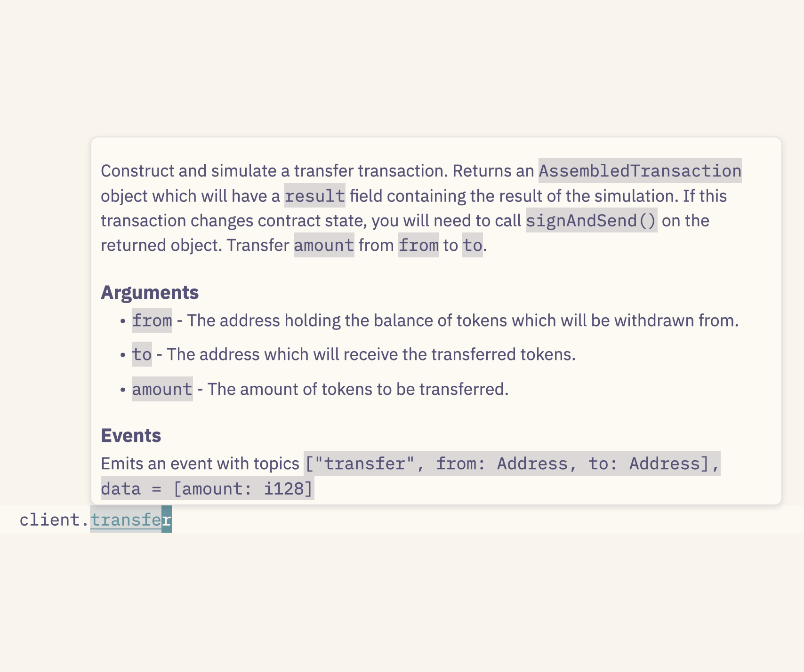

# How Stellar's dApp Tooling Optimizes for Joy

# me


* Chad O
  * (chadoh)
* Cofounder, Aha Labs
  * (and CEO?)
* prev
  * Ruby (on Rails)
  * NEAR

# How Stellar's dApp Tooling Optimizes for Joy

# How Stellar's (dApp) Tooling Optimizes for Joy

# How Stellar('s (dApp) Tooling) Optimizes for Joy

---


# : j o y :

# 😂

<!-- this always seemed TOO happy to mean "joy" to me! -->

---


<!-- as an evangelical kid, I was taught that joy came from putting jesus first! and that it wasn't an extreme happiness, but a more foundational state of mind / orientation toward the world / aspect of character -->

---


<!-- if you search for images of joy, you get a LOT of Inside Out -->

---


<!-- and also a lot of lens flare -->

---


<!-- like, a lot -->

---


<!-- so much -->

---


<!-- on and on -->

---


<!-- ChatGPT will give you lens flares, too. Why lens flares, I asked. "Lens flares are often associated with joy because they evoke the brightness and energy of sunlight, which is commonly linked to positive emotions like warmth, happiness, and freedom. Visually, lens flares can create a sense of liveliness and motion in an image, enhancing the dynamic quality of the scene. When used in moments that feature bright sunlight, the effect can highlight the carefree, radiant feeling often associated with joyful experiences, like playing outdoors, celebrations, or simply basking in a beautiful day." -->

---


# joy

<!-- class: top -->

_noun_

- Intense and especially ecstatic or exultant happiness, or an instance of such feeling.
* 😂

&nbsp;

The American Heritage® Dictionary of the English Language, 5th Edition

# joy

_according to Merriam-Webster_

* the emotion evoked by well-being, success, or good fortune

# joy

_according to Merriam-Webster_

- the emotion evoked by well-being, success, or good fortune or by the prospect of possessing what one desires

# joy

_according to Merriam-Webster_

- the emotion evoked by well-being, success, or good fortune or by the prospect of possessing what one desires, _delight_
* a source or cause of delight
* 

# stellar

<!--
backgroundImage: "url(./joy/bg.png)"
class: none
-->

1) real value, real utility
2) built in programmability
   * command line example
   * app example
3) familiar developer workflows
4) fast project setup
5) you


# 1. real value, real utility

# blockchains

# are they useful?

# what are they good for?

<!--
so many misguided thoughts on this!

- will end poverty!
- will end corruption!
- will create world peace!

-->

# as with data,<br/>so with value

# prev 30 years: info<br />&nbsp;

# prev 30 years: info<br />next 30 years: value

# prev 30 years: info<br />next 30 years: value

<!-- _backgroundImage: none -->

# real-world utility

<!--
not just "money games for rich people"

MoneyGram, UN, etc. Actual people, real use-cases.

If "programmable money" is the argument that makes sense of blockchain, then it helps to have real money in the system.
-->

# Stellar Asset Contract

# ~~1. real value, real utility~~

# 2. built in programmability

# &nbsp;

<!-- backgroundImage: none -->

# ABIs

# ABIs published to...

# ABIs published to... ???

# Etherscan API

# bake it in

<!-- backgroundImage: url(joy/bg.png) -->

# "contract spec"

# XDR

<!-- backgroundImage: none -->

# "XDR spec"

# "XDR"

# "contract XDR spec"

# "contract interface"

# really slick developer tools

<!-- backgroundImage: url(joy/bg.png) -->

## command line interface

<!-- class: top -->

* `stellar contract deploy ... --alias wow`
* `stellar contract invoke --id wow -- --help`

## command line interface

- `stellar contract deploy ... --alias wow`
- `stellar contract invoke --id wow -- --help`

```
transfer        Transfer `amount` from `from` to `to`.

                # Arguments

                * `from` - The address holding the balance of tokens which will be
                withdrawn from.
                * `to` - The address which will receive the transferred tokens.
                * `amount` - The amount of tokens to be transferred.
```

## command line interface

- `stellar contract deploy ... --alias wow`
- `stellar contract invoke --id wow -- --help`
- `stellar contract invoke --id wow -- transfer --help`

## command line interface

- `stellar contract deploy ... --alias wow`
- `stellar contract invoke --id wow -- --help`
- `stellar contract invoke --id wow -- transfer --help`

```
Usage: transfer [OPTIONS]
Options:
      --amount <i128>
          Example:
            --amount -100
      --to <Address>
          Can be public key (G13..), a contract hash (6c45307), or an identity (alice)
          Example:
            --to GDIY6AQQ75WMD4W46EYB7O6UYMHOCGQHLAQGQTKHDX4J2DYQCHVCR4W4
      --from <Address>
          Can be public key (G13..), a contract hash (6c45307) or an identity (alice),
          Example:
            --from GDIY6AQQ75WMD4W46EYB7O6UYMHOCGQHLAQGQTKHDX4J2DYQCHVCR4W4
```

## command line interface

- `stellar contract deploy ... --alias wow`
- `stellar contract invoke --id wow -- --help`
- `stellar contract invoke --id wow -- transfer --help`
- `stellar contract invoke --id wow -- transfer`<br /> `--from alice --to bob --amount 10000000`

## javascript

- `import { contract } from '@stellar/stellar-sdk'`
- `client = contract.Client.from({ contractId: 'C…' })`
- `client.transfer({`<br/>`  from: alice,`<br/>`  to: bob,`<br />`  amount: 10000000,`<br />`})`

## typescript

* `stellar contract bindings typescript --id C…`<br />`--output-dir wow`
* `import { Client, networks } from 'wow'`
* `client = new Client({ ...networks.testnet })`

---



# ~~2. built in programmability~~

<!-- class: none -->

# 3. familiar developer workflows

## `network container`

* no Ganache or whatever
* local development
* controlled environment for tests
* snapshotting
* in the future: UI

# ~~3. familiar developer workflows~~

# 4. fast project setup

## `stellar contract init`

# ~~4. fast project setup~~

# 5. you

## don't just build apps

## don't just build apps,<br />build tooling!

## the foundations you need

1) technological
2) community
3) financial 
   * Stellar Community Fund "tooling" track

# got ideas?<br /> build on Stellar!

# questions?

1. real value, real utility
2. built in programmability
   - command line example
   - app example
3. familiar developer workflows
4. fast project setup
5. you
