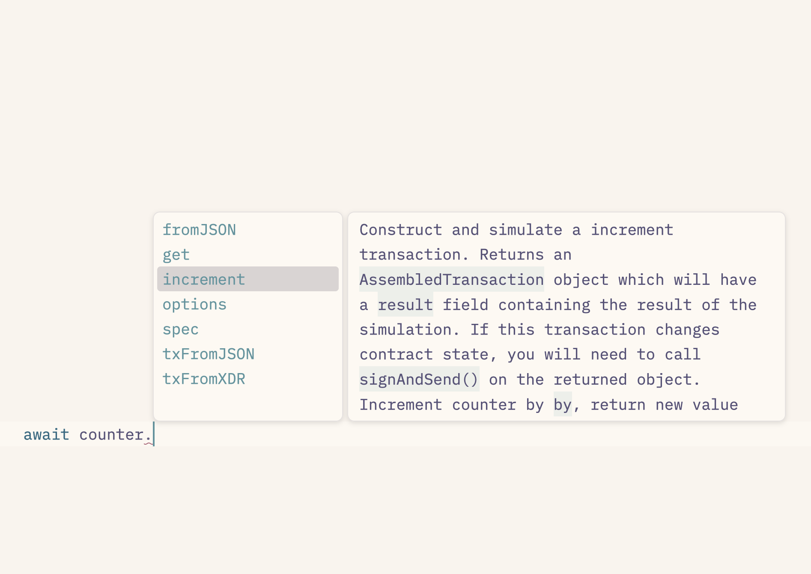
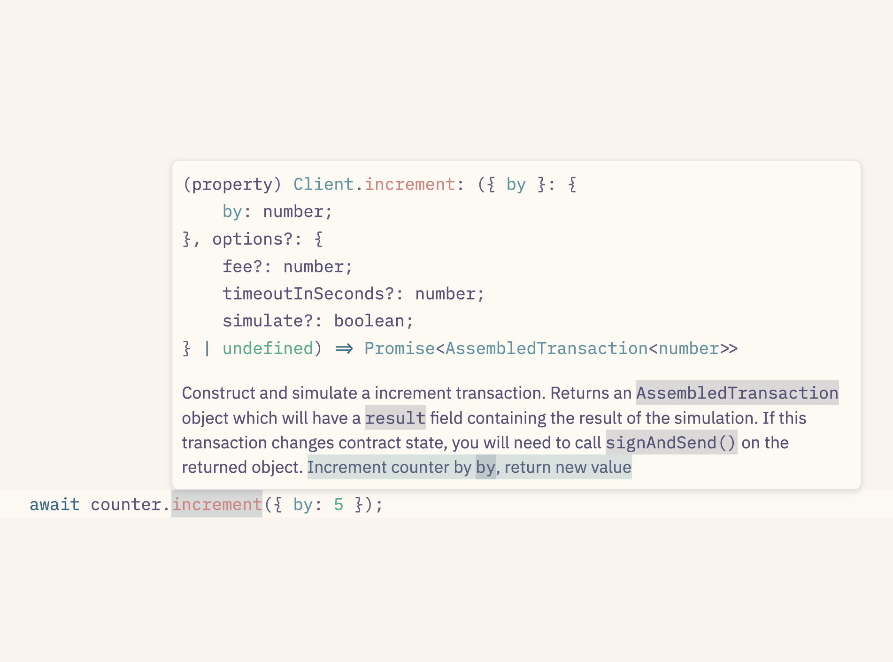

# How Stellar's dApp Tooling Optimizes for Joy

# me


# me


- Chad O

# me


- Chad O
  - (chadoh)

# me


- Chad O
  - (chadoh)
- Cofounder & CEO, Aha Labs

# me


- Chad O
  - (chadoh)
- Cofounder & CEO, Aha Labs
- prev

# me


- Chad O
  - (chadoh)
- Cofounder & CEO, Aha Labs
- prev
  - Ruby (on Rails)

# me


- Chad O
  - (chadoh)
- Cofounder & CEO, Aha Labs
- prev
  - Ruby (on Rails)
  - NEAR

# How Stellar's dApp Tooling Optimizes for Joy

# How Stellar's (dApp) Tooling Optimizes for Joy

# How Stellar('s (dApp) Tooling) Optimizes for Joy

---


# : j o y :

# 😂

<!-- _class: big -->

<!-- this always seemed TOO happy to mean "joy" to me! -->

---


<!-- if you search for images of joy, you get a LOT of Inside Out -->

---


<!-- and also a lot of lens flare -->

---


<!-- like, a lot -->

---


<!-- so much -->

---


<!-- on and on -->

---


<!-- ChatGPT will give you lens flares, too. Why lens flares, I asked. "Lens flares are often associated with joy because they evoke the brightness and energy of sunlight, which is commonly linked to positive emotions like warmth, happiness, and freedom. Visually, lens flares can create a sense of liveliness and motion in an image, enhancing the dynamic quality of the scene. When used in moments that feature bright sunlight, the effect can highlight the carefree, radiant feeling often associated with joyful experiences, like playing outdoors, celebrations, or simply basking in a beautiful day." -->

---


# joy

<!-- class: top -->

_noun_

- Intense and especially ecstatic or exultant happiness, or an instance of such feeling.

# joy

<!-- class: top -->

_noun_

- Intense and especially ecstatic or exultant happiness, or an instance of such feeling.
- 😂

# joy

_noun_

- the emotion evoked by well-being, success, or good fortune

# joy

_noun_

- the emotion evoked by well-being, success, or good fortune or by the prospect of possessing what one desires

# joy

_noun_

- the emotion evoked by well-being, success, or good fortune or by the prospect of possessing what one desires, _delight_

# joy

_noun_

- the emotion evoked by well-being, success, or good fortune or by the prospect of possessing what one desires, _delight_
- a source or cause of delight

# joy

_noun_

- the emotion evoked by well-being, success, or good fortune or by the prospect of possessing what one desires, _delight_
- a source or cause of delight
- 

# stellar

<!--
backgroundImage: "url(img/bg.png)"
class: none
-->

# stellar

1. real value, real utility

# stellar

1. real value, real utility
2. familiar developer workflows

# stellar

1. real value, real utility
2. familiar developer workflows
3. built-in programmability

# stellar

1. real value, real utility
2. familiar developer workflows
3. built-in programmability
   - command line example

# stellar

1. real value, real utility
2. familiar developer workflows
3. built-in programmability
   - command line example
   - app example

# stellar

1. real value, real utility
2. familiar developer workflows
3. built-in programmability
   - command line example
   - app example
4. you

# 1. real value, real utility

# blockchains

# what are they good for?

<!--
so many misguided thoughts on this!

- will end poverty!
- will end corruption!
- will create world peace!

-->

# as with data,<br/>so with value

# prev 30 years: info<br />&nbsp;

# prev 30 years: info<br />next 30 years: value

# prev 30 years: info<br />next 30 years: value

<!-- _backgroundImage: none -->

# real-world utility

# real-world utility

- MoneyGram

# real-world utility

- MoneyGram
- UNHCR

# real-world utility

- MoneyGram
- UNHCR
- Decaf, Beans, Blend, ...

# real-world utility

- MoneyGram
- UNHCR
- Decaf, Beans, Blend, ...
- almost a decade of real value

<!--
not just "money games for rich people"

MoneyGram, UN, etc. Actual people, real use-cases.

If "programmable money" is the argument that makes sense of blockchain, then it helps to have real money in the system.
-->

# ~~1. real value, real utility~~

# 2. familiar developer workflows

## `stellar network container`

## `stellar network container`

- Horizon

## `stellar network container`

- Horizon
- RPC

## `stellar network container`

- Horizon
- RPC
- Friendbot

## `stellar network container`

## `stellar network container`

- no Ganache or whatever

## `stellar network container`

- no Ganache or whatever
- local development

## `stellar network container`

- no Ganache or whatever
- local development
- controlled environment for tests

## `stellar network container`

- no Ganache or whatever
- local development
- controlled environment for tests
- snapshotting

## `stellar network container`

- no Ganache or whatever
- local development
- controlled environment for tests
- snapshotting
- in the future: UI

# ~~2. familiar developer workflows~~

# 3. built-in programmability

# &nbsp;

<!-- backgroundImage: none -->

# ABIs

## Application Binary Interfaces

# ABIs published to...

# ABIs published to... ???

# Etherscan API

# bake it in

<!-- backgroundImage: url(img/bg.png) -->

# contract spec

# really slick developer tools

## example

<!-- class: top -->

## example

`stellar contract init my-project`<br />`--with-example increment`

---

```rs
/// Increment increments an internal counter, and returns the value.
pub fn increment(env: Env) -> u32 {
    ...
}
```

---

```rs
/// Increment increments an internal counter, and returns the value.
pub fn increment(env: Env) -> u32 {
    ...
}
```

`stellar contract build`

---

```rs
/// Increment increments an internal counter, and returns the value.
pub fn increment(env: Env) -> u32 {
    ...
}
```

`stellar contract deploy --wasm .../increment.wasm`<br />`--alias counter`

---

```rs
/// Increment increments an internal counter, and returns the value.
pub fn increment(env: Env) -> u32 {
    ...
}
```

`stellar contract invoke --id counter -- --help`

---

```rs
/// Increment increments an internal counter, and returns the value.
pub fn increment(env: Env) -> u32 {
    ...
}
```

`stellar contract invoke --id counter -- --help`

```
Commands:
  increment  Increment increments an internal counter, and returns the value.
  help       Print this message or the help of the given subcommand(s)
```

---

```rs
/// Increment increments an internal counter, and returns the value.
pub fn increment(env: Env) -> u32 {
    ...
}
```

`stellar contract invoke --id counter -- --help`

```
Commands:
  increment  Increment increments an internal counter, and returns the value.
  help       Print this message or the help of the given subcommand(s)
```

`stellar contract invoke --id counter -- increment`

---


```rs
/// Increment increments an internal counter, and returns the value.
pub fn increment(env: Env) -> u32 {
    ...
}
```

---

```rs
/// Increment counter, return new value
pub fn increment(env: Env) -> u32 {
    ...
}
```

---

```rs
/// Increment counter by `by`, return new value
pub fn increment(env: Env, by: u32) -> u32 {
    ...
}
```

---

```rs
/// Increment counter by `by`, return new value
pub fn increment(env: Env, by: u32) -> u32 { ... }
/// Get current value of counter
pub fn get(env: Env) -> u32 { ... }
```

---

```rs
/// Increment counter by `by`, return new value
pub fn increment(env: Env, by: u32) -> u32 { ... }
/// Get current value of counter
pub fn get(env: Env) -> u32 { ... }
```

`stellar contract build`

---

```rs
/// Increment counter by `by`, return new value
pub fn increment(env: Env, by: u32) -> u32 { ... }
/// Get current value of counter
pub fn get(env: Env) -> u32 { ... }
```

`stellar contract deploy --wasm .../increment.wasm`<br />`--alias counter`

---

```rs
/// Increment counter by `by`, return new value
pub fn increment(env: Env, by: u32) -> u32 { ... }
/// Get current value of counter
pub fn get(env: Env) -> u32 { ... }
```

`stellar contract invoke --id counter -- --help`

---

```rs
/// Increment counter by `by`, return new value
pub fn increment(env: Env, by: u32) -> u32 { ... }
/// Get current value of counter
pub fn get(env: Env) -> u32 { ... }
```

`stellar contract invoke --id counter -- --help`

```
Commands:
  increment  Increment counter by `by`, return new value
  get        Get current value of counter
  help       Print this message or the help of the given subcommand(s)
```

---

```rs
/// Increment counter by `by`, return new value
pub fn increment(env: Env, by: u32) -> u32 { ... }
```

`stellar contract invoke --id counter -- --help`
`stellar contract invoke --id counter -- increment`<br />`--help`

---

```rs
/// Increment counter by `by`, return new value
pub fn increment(env: Env, by: u32) -> u32 { ... }
```

`stellar contract invoke --id counter -- increment`<br />`--help`

```
Increment counter by `by`, return new value

Usage: increment [OPTIONS]

Options:
      --by <u32>
          Example:
            --by 1
```

---

```rs
/// Increment counter by `by`, return new value
pub fn increment(env: Env, by: u32) -> u32 { ... }
```

`stellar contract invoke --id counter -- increment`<br />`--help`

`stellar contract invoke --id counter -- increment`<br />`--by 5`

---

```bash
alias counter="stellar contract invoke --id counter --"
```

---

```bash
alias counter="stellar contract invoke --id counter --"
```

`counter --help`

---

```bash
alias counter="stellar contract invoke --id counter --"
```

`counter --help`

`counter increment --help`

---

```bash
alias counter="stellar contract invoke --id counter --"
```

`counter --help`

`counter increment --help`

`counter increment --by 5`

## javascript

## javascript

```js
import { Client } from '@stellar/stellar-sdk/counter'
```

## javascript

```js
import { Client } from '@stellar/stellar-sdk/counter'

const counter = Client.from({ contractId: 'C…' })
```

## javascript

```js
import { Client } from '@stellar/stellar-sdk/counter'

const counter = Client.from({ contractId: 'C…' })

counter.increment({ by: 5 })
```

## typescript

## typescript

`stellar contract bindings typescript --id counter`<br />`--output-dir packages/counter`

## typescript

`stellar contract bindings typescript --id counter`<br />`--output-dir packages/counter`

###### package.json
```json
  "workspaces": [
    "packages/*"
  ],
```

## typescript

`stellar contract bindings typescript --id counter`<br />`--output-dir packages/counter`

```ts
import { Client, networks } from 'counter'
```

## typescript

`stellar contract bindings typescript --id counter`<br />`--output-dir packages/counter`

```ts
import { Client, networks } from 'counter'

const counter = new Client({ ...networks.testnet })
```

---



---



# ~~3. built-in programmability~~

<!-- class: none -->

# 4. you

## don't just build apps<br />&nbsp;

## don't just build apps<br />build tooling!

<!-- including CLI plugins! -->

## the foundations you need

<!-- class: top -->

## the foundations you need

1. technological

## the foundations you need

1. technological

- [Rust](https://github.com/stellar/stellar-cli/blob/88a8ca91a28afe0da63debb448b2d0a8060f99e5/cmd/soroban-cli/src/commands/contract/invoke.rs\#L163) &nbsp;&nbsp;&nbsp;&nbsp;&nbsp;&nbsp;&nbsp; 

## the foundations you need

1. technological

- [Rust](https://github.com/stellar/stellar-cli/blob/88a8ca91a28afe0da63debb448b2d0a8060f99e5/cmd/soroban-cli/src/commands/contract/invoke.rs\#L163) &nbsp;&nbsp;&nbsp;&nbsp;&nbsp;&nbsp;&nbsp; 
- [Typescript](https://github.com/stellar/js-stellar-sdk/blob/ebab1837df0a0a8ebb8e75f7878f2129f06819de/src/contract/spec.ts\#L468) 

## the foundations you need

1. technological
2. financial 

## the foundations you need

1. technological
2. financial 
   - Stellar Community Fund [dev tooling](https://communityfund.stellar.org/projects?name=&category=Developer%20Tooling) track

     

## the foundations you need

1. technological
2. financial 
3. community

## the foundations you need

1. technological
2. financial 
3. community
   - Okashi

## the foundations you need

1. technological
2. financial 
3. community
   - Okashi
   - CommuniDAO

## the foundations you need

1. technological
2. financial 
3. community
   - Okashi
   - CommuniDAO
   - Loam

## the foundations you need

1. technological
2. financial 
3. community
   - Okashi
   - CommuniDAO
   - Loam
     - (come see me again!)

# got ideas?<br /> build on Stellar!

<!-- class: none -->

# questions?

1. real value, real utility
2. familiar developer workflows
3. built-in programmability
   - command line example
   - app example
4. you
